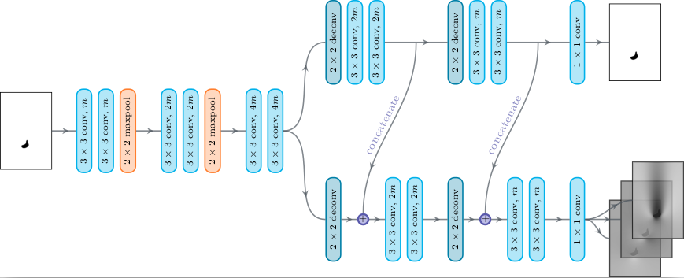
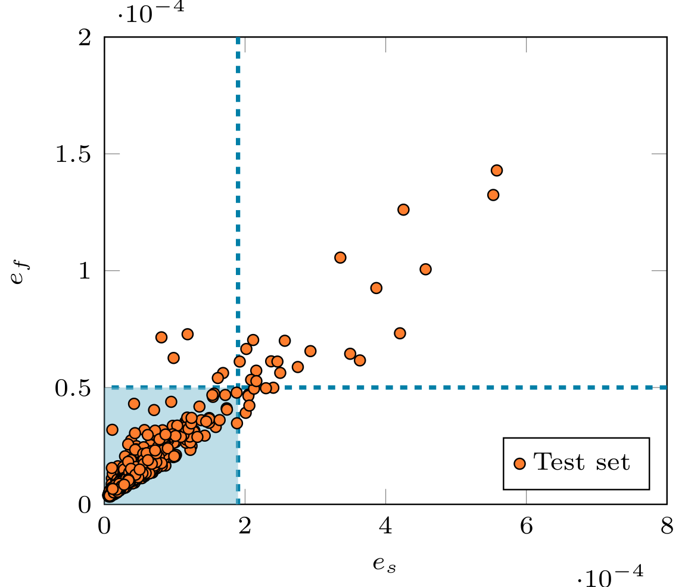
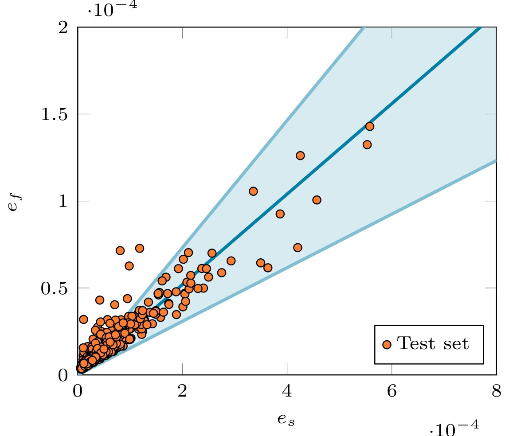

# twin_autoencoder

A project concerned with the prediction of laminor flow fields around random shapes, with built-in outlier prediction based on correlated output branches. If you exploit this work for your own research, please consider citing <a href="">the article</a> or <a href="https://arxiv.org/abs/2104.03619">the pre-print</a>. **This work was produced during the PhD thesis of <a href="https://github.com/junfeng-chen">J. Chen</a>**

<p align="center">
  
</p>

The proposed CNN architecture has two decoder branches: one reconstructs the input geometry while th other performs laminar flow prediction. The shared latent features and skip connections between the two branches make their outputs highly correlated. It it thus possible to estimate the uncertainty of flow prediction based on the geometry reconstruction.

The data set contains 12000 random 2D obstacles, together with the laminar velocity and pressure field. It was also used in the following articles:
- J. Viquerat and E. Hachem, "[A supervised neural network for drag prediction of arbitrary 2D shapes in laminar flows at low Reynolds number](https://github.com/jviquerat/cnn_drag_prediction)"
- J. Chen, J. Viquerat and E. Hachem, "[Graph neural networks for laminar flow prediction around random 2D shapes](https://github.com/jviquerat/gnn_laminar_flow)"

The entire project are has been validated in **Ubuntu 20.04**. To reproduce the results, it is preferred to creat a virtual environment with **python==3.6.9**, and install the packages listed in **requirements.txt**.

## Structure of the repository

- **dataset_utils** : general functions, including data pre-processing, results plotting etc.
- **network_utils** : layers and models used in the article
- **params** : directions, network hyper-parameters etc.
- **train_predict** : load data set and train a model, save the learning history and the mean squared error over the whole data set
- **predict_images**: visualization of the reconstructed input and the flow prediction
- **mistake_minimization** : an independent script searching the optimal threshold of the reconstruction error for the qualitative method (section 3.3.1)
- **nll_minimization** : an independent script solving the linear regression problem for the quantitative trust level method (section 3.3.2)
- **Depth5** : results direction saving the model, and the mean squared errors in csv format

## Model training

Specify model's name in ```train_predict.py``` by choosing one of the four models:

```
Twin_AE5, Twin_AE6, Dual_AE, U_Dual_AE
```

To train a model, run

```
python3 train_predict.py
```

To get the threshold in the qualitative method, run

```
python3 mistake_minimization.py
```

<p align="center">
  
</p>


To get the regression line in the quantitative method, run

```
python3 nll_minimization.py
```

<p align="center">
  
</p>
